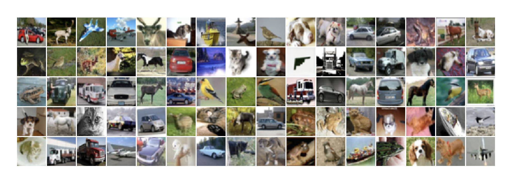
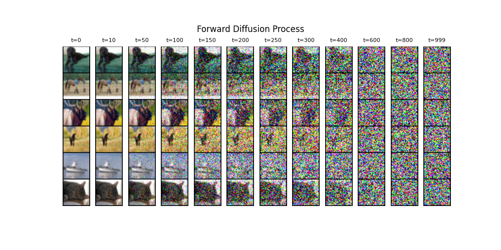

# MiniDiffusion
A PyTorch implementation of a diffusion model for unconditional image generation.

Based on the implementation of the paper [Denoising Diffusion Probabilistic Models](https://arxiv.org/abs/2006.11239) by [labml.ai](https://nn.labml.ai) as well
as the [learnopencv](https://github.com/spmallick/learnopencv/blob/master/Guide-to-training-DDPMs-from-Scratch/Generating_MNIST_using_DDPMs.ipynb) guide.

The `model` directory contains the `UNet` class, used in this 
implementation as the epsilon model for predicting the noise added
during the diffusion process; the `DenoiseDiffusion` class, used
for sampling and loss calculation during training; `dataloader.py`, which loads in the training set (you can choose the dataset in `configs.py`); `train.py`, which
trains the diffusion model; and `generate.py`, which samples from the 
learned distribution to generate new images.

`tests` contains scripts for visualizing the dataset and the
diffusion process, as well as generating new images with `generate.py`.

Here are some snapshots taken during experimentation:

