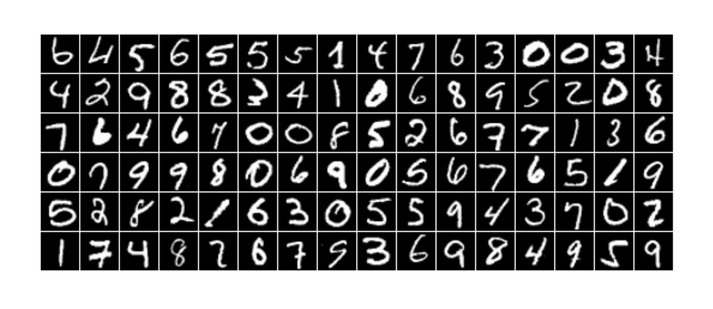

# MiniDiffusion
A PyTorch implementation of a diffusion model for unconditional image generation.

Based on the implementation of the paper [Denoising Diffusion Probabilistic Models](https://arxiv.org/abs/2006.11239) by [labml.ai](https://nn.labml.ai) as well
as the [learnopencv](https://github.com/spmallick/learnopencv/blob/master/Guide-to-training-DDPMs-from-Scratch/Generating_MNIST_using_DDPMs.ipynb) guide.

The `model` directory contains the `UNet` class, used in this 
implementation as the epsilon model for predicting the noise added
during the diffusion process; the `DenoiseDiffusion` class, used
for sampling and loss calculation during training; `dataloader.py`, which loads in the training set (you can choose the dataset in `configs.py`, as well as modify various training parameters); `train.py`, which
trains the diffusion model; and `generate.py`, which samples from the 
learned distribution to generate new images.

`tests` contains scripts for visualizing the dataset and the
diffusion process, as well as snapshots showing the results of training the model on MNIST and CIFAR-10 (the sampling snapshots are taken from the denoising videos generated via `model/generate.py`).

The `simple-diffusion` branch uses a more lightweight UNet architecture and diffusion pipeline, adopted from learnopencv. I found that this model trains roughly 2x faster than the model in `main`, and produces samples that more closely resemble the training space. The snapshots below are taken from my experimentation and results with `simple-diffusion`.

CIFAR-10 Data Sample and Noising Process:

Generating a set of new images starting from pure noise after training on CIFAR-10 for 30 epochs (timesteps 0, 499, 749, 999 shown); i.e. the learned denoising process:

MNIST Data Sample and Noising Process:

Generating a set of new images starting from pure noise after training on MNIST for 30 epochs (timesteps 0, 499, 749, 999):

